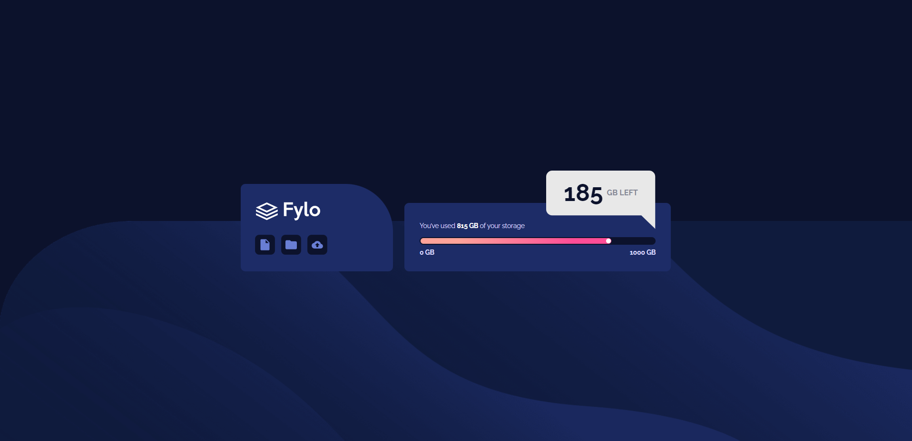

# Frontend Mentor - Fylo data storage component solution

This is a solution to the [Fylo data storage component challenge on Frontend Mentor](https://www.frontendmentor.io/challenges/fylo-data-storage-component-1dZPRbV5n). Frontend Mentor challenges help you improve your coding skills by building realistic projects.

## Table of contents

- [Overview](#overview)
  - [The challenge](#the-challenge)
  - [Screenshot](#screenshot)
  - [Links](#links)
- [My process](#my-process)
  - [Built with](#built-with)
  - [What I learned](#what-i-learned)
  - [Continued development](#continued-development)
- [Author](#author)
- [Acknowledgments](#acknowledgments)

## Overview

### The challenge

Users should be able to:

- View the optimal layout for the site depending on their device's screen size

### Screenshot

### Links

- Solution URL: [Here](https://your-solution-url.com)
- Live Site URL: [Here](https://igafshell.github.io/fylo-data-storage-component-main/)

## My process

### Built with

- Basic HTML
- SCSS
- BEM markup

### What I learned

Positioning the message element was a bit of a struggle and I learned a lot how to use negative values with margins.

### Continued development

I'll continue to learn SCSS and build projects.

## Author

- Github - [igafshell](https://github.com/igafshell)
- Frontend Mentor - [@igafshell](https://www.frontendmentor.io/profile/igafshell)
- Twitter - [@igafshell](https://www.twitter.com/igafshell)

## Acknowledgments

Thanks to [Frontend Mentor](https://www.frontendmentor.io) for the awesome project!
